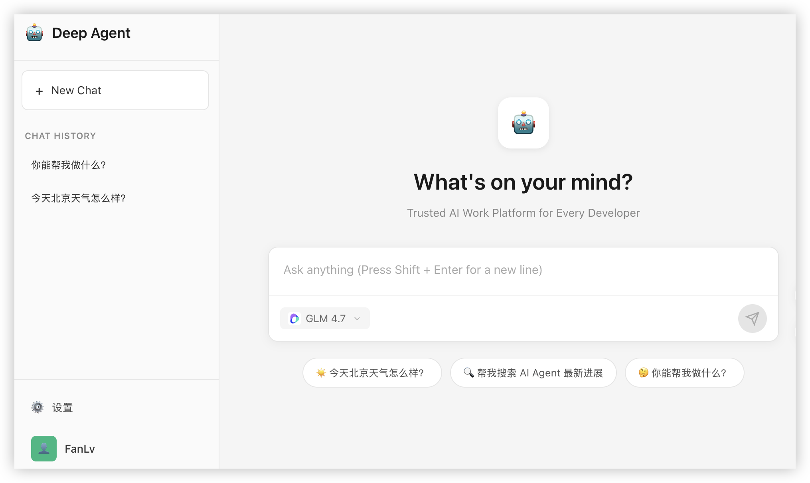

# Deep Agent Demo

基于 Eino 框架的 Deep Agent 演示项目。

[English Version](./README.md)

## 快速开始

```
git clone git@github.com:deep-agent/sandbox.git
cd sandbox

# 创建主机持久化目录（工作区、提示词等）
mkdir /path/to/memory
mkdir /path/to/memory/workspace
mkdir /path/to/memory/agent

# 设置主机持久化目录（工作区、提示词等）
export LOCAL_MEMORY="/path/to/memory"

# Linux 下容器用户（UID 1000）与宿主机用户不同，需调整目录权限以避免 Permission Denied
sudo chown -R 1000:1000 /path/to/memory
sudo chown -R 1000:1000 /path/to/memory/workspace
sudo chown -R 1000:1000 /path/to/memory/agent

# 启动 sandbox 容器
make docker-start

# 进入 deep-agent-demo 并启动 Web
cd deep-agent-demo
make web
```


